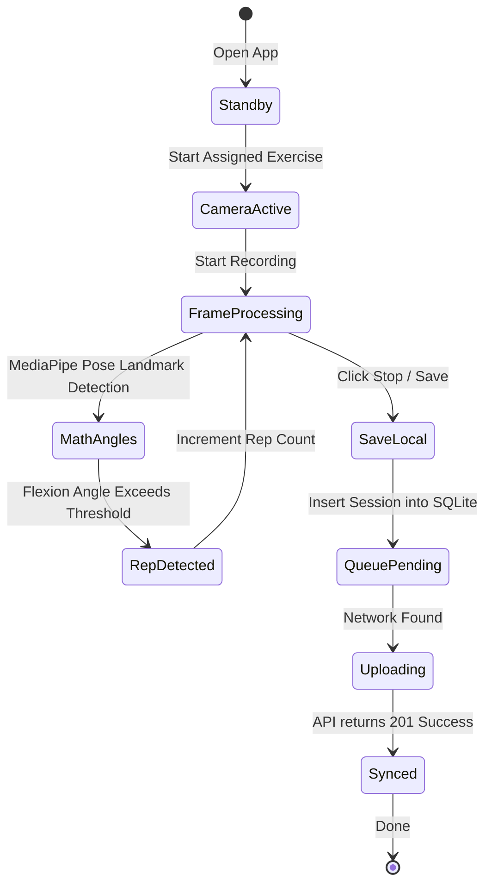

# Mobile App Task Checklist & Camera Workflows

This document outlines the patient-app features, live pose processing loops, local database steps, and task checklists for the **JoGait Mobile App**.

---

## 1. Feature Specifications
*   **Guided Positioning Overlay**: Smart camera mask ensuring the patient stands at correct distance and lighting.
*   **Real-time Joint Analyzer**: Local mathematical processing calculating extension angles at 30 frames per second.
*   **Auto-Repetition Counter**: Mathematical wave peak detector converting raw angles into confirmed workout reps.
*   **Robust Offline Cache**: Local SQLite database storing full session details.
*   **Automated Sync Manager**: Background service that uploads session metrics automatically when Wi-Fi becomes active.

---

## 2. On-Device Execution & Sync Flow

---

## 3. Development Task List

### Phase 1: Setup & Device Camera
- [ ] Set up React Native / Expo workspace configuration files.
- [ ] Request system camera permissions with native popup alerts.
- [ ] Integrate React Native Vision Camera view inside custom container.
- [ ] Build canvas skeletal overlays matching mock pose coordinate keypoints.

### Phase 2: Local AI & Calculations
- [ ] Integrate local TFLite or MediaPipe WebAssembly pose estimators.
- [ ] Code mathematical vector calculations determining 3D joint degrees.
- [ ] Build peak-detection algorithms to track exercise rep completions.
- [ ] Code real-time visual alerts (e.g., "Adjust Camera", "Knee angle too low").

### Phase 3: Storage & Network Synchronization
- [ ] Setup local SQLite database helper module.
- [ ] Build transaction methods saving completed session logs and metrics.
- [ ] Code background sync scheduler checking network connectivity.
- [ ] Implement sync queue state listeners, updating the UI when upload completes.
